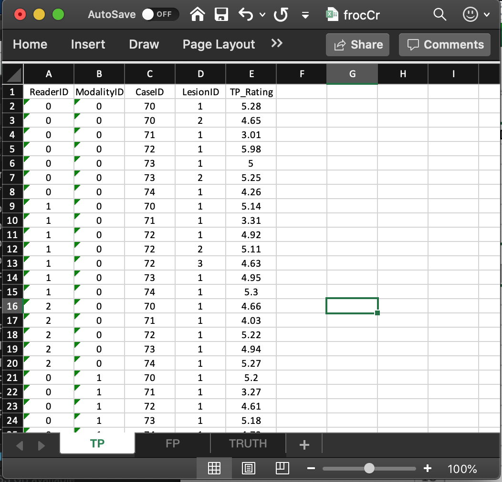

# Data format and reading FROC data {#quick-start-froc-data-format}


## TBA How much finished {#quick-start-froc-data-format-how-much-finished}
90%


## Introduction {#quick-start-froc-data-intro}
In the Free-response Receiver Operating Characteristic (FROC) paradigm the observer searches each case for signs of **localized disease** and marks and rates localized regions that are sufficiently suspicious for presence of disease. FROC data consists of **mark-rating pairs**, where each mark is a localized-region that was considered sufficiently suspicious for presence of a localized lesion and the rating is it's confidence level. As in the ROC paradigm, the rating can be an integer or quasi-continuous (e.g., 0 – 100), or a floating point value, *as long as higher numbers represent greater confidence in presence of a lesion at the indicated region*. This is termed a positive-directed confidence level scheme. By adopting a proximity criterion, the investigator classifies each mark as a lesion localization (`LL`) - if it is close to a real lesion - or a non-lesion localization (`NL`) otherwise. 

The purpose of this chapter is to:

* Explain the data format of the input Excel file for FROC datasets. 
* Explain the format of the FROC dataset.
* Explain the lesion distribution array returned by `UtilLesionDistr()`.
* Explain the lesion weights array returned by `UtilLesionWeightsDistr()`.
* Details on the FROC paradigm are in my book [@chakraborty2017observer].

The chapter is illustrated with a toy data file, `R/quick-start/frocCr.xlsx` in which readers '0', '1' and '2' interpret 8 cases in two modalities, '0' and '1'. The design is 'factorial', abbreviated to `FCTRL` in the software; this is also termed a 'fully-crossed' design. The Excel file has three worksheets named `Truth`, `NL` (or `FP`) and `LL` (or `TP`). 

## The `Truth` worksheet {#quick-start-froc-data-truth}
{width=100%}

* The `Truth` worksheet contains 6 columns: `CaseID`, `LesionID`, `Weight`, `ReaderID`, `ModalityID` and `Paradigm`. 
* Since a diseased case may have more than one lesion, the first five columns contain **at least** as many rows as there are cases (images) in the dataset. There are 8 cases in the dataset and 12 rows of data, because some of the diseased cases contain more than one lesion.
* `CaseID`: unique **integers** representing the cases in the dataset: '1', '2', '3', the 3 non-diseased cases, and '70', '71', '72', '73', '74', the 5 diseased cases. The ordering of the numbers is inconsequential. ^[`CaseID` should not be so large that it cannot be represented in Excel by an integer; to be safe use unsigned short 8-bit integers. For example, 108057200 or 9971103254 are too large to be a valid `caseID` and may cause errors.] 
* `LesionID`: integers 0, 1, 2, etc., 
    + Each 0 represents a non-diseased case, 
    + Each 1 represents the *first* lesion on a diseased case, 2 the *second* lesion, if present, and so on. 
    + This field is zero for non-diseased cases '1', '2', '3'. 
    + For the first diseased case, i.e., '70', it is 1 for the first lesion and 2 for the second lesion. 
    + For the second diseased case i.e., '71', it is 1, as this case has only one lesion.
    + For the third diseased case, i.e., '72', it is 1 for the first lesion, 2 for the second lesion and 3 for the third lesion. 
    + For the fourth diseased case, i.e., '73', it is 1 for the first lesion and 2 for the second lesion. 
    + For the fifth diseased case i.e., '74', it is 1, as this case has only one lesion.
* There are 3 non-diseased cases in the dataset (the number of 0's in the `LesionID` column).
* There are 5 diseased cases in the dataset (the number of 1's in the `LesionID` column). 
* `Weight` or clinical importance - e.g., mortality associated with lesion:
    + non-negative floating point values 
    + 0 for each non-diseased case
    + For each diseased case values that sum to unity. 
    + A simple way to assign equal weights to all lesions in a case is to fill the `Weight` column with zeroes.
* `LesionID` 
    + Diseased case `70` has two lesions, with `LesionID`s '1' and '2', and weights 0.3 and 0.7. 
    + Diseased case `71` has one lesion, with `LesionID` = 1, and `Weight` = 1. 
    + Diseased case `72` has three lesions, with `LesionID`s 1, 2 and 3 and weights 1/3 each. 
    + Diseased case `73` has two lesions, with `LesionID`s 1, and 2 and weights 0.1 and 0.9. 
    + Diseased case `74` has one lesion, with `LesionID` = 1 and `Weight` = 1.
* `ReaderID`: a comma-separated listing of readers, each represented by a unique **text label**, that have interpreted the case. In the example shown below each cell has the value '0, 1, 2'. 
* There are 3 readers in the dataset, as each cell in the `ReaderID` column contains '0, 1, 2'.
* `ModalityID`: a comma-separated listing of modalities (or treatments), each represented by a unique **integer**, that apply to each case. In the example each cell has the value `0, 1`. **Each cell has to be text formatted.**
* There are 2 modalities in the dataset, as each cell in the `ModalityID` column contains '0, 1'.
* `Paradigm`: The contents are `FROC` and `FCTRL`: this is an `FROC` dataset and the design is "factorial".

## Reading the FROC dataset {#quick-start-froc-data-structure}
The example shown above corresponds to file `R/quick-start/frocCr.xlsx` in the project directory. The next code chunk reads this file into an `R` object `x`.


```r
frocCr <- "R/quick-start/frocCr.xlsx"
x <- DfReadDataFile(frocCr, newExcelFileFormat = TRUE)
str(x)
#> List of 3
#>  $ ratings     :List of 3
#>   ..$ NL   : num [1:2, 1:3, 1:8, 1:2] 1.02 2.89 2.21 3.01 2.14 ...
#>   ..$ LL   : num [1:2, 1:3, 1:5, 1:3] 5.28 5.2 5.14 4.77 4.66 4.87 3.01 3.27 3.31 3.19 ...
#>   ..$ LL_IL: logi NA
#>  $ lesions     :List of 3
#>   ..$ perCase: int [1:5] 2 1 3 2 1
#>   ..$ IDs    : num [1:5, 1:3] 1 1 1 1 1 ...
#>   ..$ weights: num [1:5, 1:3] 0.3 1 0.333 0.1 1 ...
#>  $ descriptions:List of 7
#>   ..$ fileName     : chr "frocCr"
#>   ..$ type         : chr "FROC"
#>   ..$ name         : logi NA
#>   ..$ truthTableStr: num [1:2, 1:3, 1:8, 1:4] 1 1 1 1 1 1 1 1 1 1 ...
#>   ..$ design       : chr "FCTRL"
#>   ..$ modalityID   : Named chr [1:2] "0" "1"
#>   .. ..- attr(*, "names")= chr [1:2] "0" "1"
#>   ..$ readerID     : Named chr [1:3] "0" "1" "2"
#>   .. ..- attr(*, "names")= chr [1:3] "0" "1" "2"
```

This follows the general description in Chapter \@ref(quick-start-data-format). The differences are described below.

* The `x$descriptions$type` member indicates that this is an `FROC` dataset. 
* The `x$lesions$perCase` member is a vector whose contents reflect the number of lesions in each diseased case, i.e., 2, 1, 3, 2, 1 in the current example.
* The `x$lesions$IDs` member indicates the labeling of the lesions in each diseased case.


```r
x$lesions$IDs
#>      [,1] [,2] [,3]
#> [1,]    1    2 -Inf
#> [2,]    1 -Inf -Inf
#> [3,]    1    2    3
#> [4,]    1    2 -Inf
#> [5,]    1 -Inf -Inf
```

* This shows that the lesions on the first diseased case are labeled '1' and '2'. The `-Inf` is a filler used to denote a missing value. The second diseased case has one lesion labeled '1'. The third diseased case has three lesions labeled '1', '2' and '3', etc.
* The `lesionWeight` member is the clinical importance of each lesion. Lacking specific clinical reasons, the lesions should be equally weighted; this is *not* true for this toy dataset.


```r
x$lesions$weights
#>           [,1]      [,2]      [,3]
#> [1,] 0.3000000 0.7000000      -Inf
#> [2,] 1.0000000      -Inf      -Inf
#> [3,] 0.3333333 0.3333333 0.3333333
#> [4,] 0.1000000 0.9000000      -Inf
#> [5,] 1.0000000      -Inf      -Inf
```

* The first diseased case has two lesions, the first has weight 0.3 and the second has weight 0.7. 
* The second diseased case has one lesion with weight 1. 
* The third diseased case has three equally weighted lesions, each with weight 1/3. Etc.


## The false positive (FP) ratings {#quick-start-froc-data-fp}
These are found in the `FP` or `NL` worksheet.

{width=100%}

* It consists of 4 columns, of equal length. The common length is an integer random variable greater than or equal to zero. It could be zero if the dataset has no NL marks (a possibility if the lesions are very easy to find and the observer has perfect performance).  
* In the example dataset, the common length is 22.
* `ReaderID`: the reader labels: these must be `0`, `1`, or `2`, as declared in the `Truth` worksheet. 
* `ModalityID`: the modality labels: must be `0` or `1`, as declared in the `Truth` worksheet. 
* `CaseID`: the labels of cases with `NL` marks. In the FROC paradigm `NL` events can occur on non-diseased **and** diseased cases. 
* `FP_Rating`: the floating point ratings of `NL` marks. Each row of this worksheet yields a rating corresponding to the values of `ReaderID`, `ModalityID` and `CaseID` for that row.
* For `ModalityID` 0, `ReaderID` 0 and `CaseID` 1 (the first non-diseased case declared in the `Truth` worksheet), there is a single `NL` mark that was rated 1.02, corresponding to row 2 of the `FP` worksheet.
* Diseased cases with `NL` marks are also recorded in the `FP` worksheet. Some examples are seen at rows 15, 16 and 21, 22, 23. 
* Rows 21 and 22 show that `caseID` = 71 got two `NL` marks, rated 2.24, 4.01. 
* Since this is the *only* case with two NL marks, it determines the length of the fourth dimension of the `x$ratings$NL` list member, 2. Absent this case, the length would have been one.
* The case with the most `NL` marks determines the length of the fourth dimension of the `x$ratings$NL` list member.
* The reader should confirm that the ratings in `x$ratings$NL` reflect the contents of the `FP` worksheet.

## The true positive (TP) ratings {#quick-start-froc-data-tp}
These are found in the `TP` or `LL` worksheet, see below.


{width=100%}

* This worksheet can only have diseased cases. The presence of a non-diseased case in this worksheet will generate an error.
* The common vertical length, 31 in this example, is a-priori unpredictable. The maximum possible length, assuming every lesion is marked for each modality, reader and diseased case, is 9 X 2 X 3 = 54. The 9 comes from the total number of non-zero entries in the `LesionID` column of the `Truth` worksheet, the 2 from the number of modalities and 3 from the number of readers.
* The fact that the actual length (31) is smaller than the maximum length (54) means that there are combinations of modality, reader and diseased cases on which some lesions were not marked.
* As examples, line 2 in the worksheet, the first lesion in `CaseID` equal to `70` was marked (and rated 5.28) in `ModalityID` `0` and `ReaderID` `0`. Line 3 in the worksheet, the second lesion in `CaseID` equal to `70` was also marked (and rated 4.65) in `ModalityID` `0` and `ReaderID` `0`. However, lesions 2 and 3 in `CaseID` = 72 were not marked (line 5 in the worksheet indicates that for this modality-reader-case combination only the first lesion was marked).
* The length of the fourth dimension of the `x$ratings$LL` list member, 3 in the present example, is determined by the diseased case (72) with the most lesions in the `Truth` worksheet.
* The reader should confirm that the ratings in `x$ratings$LL` reflect the contents of the `TP` worksheet.

## On the distribution of numbers of lesions in diseased cases {#quick-start-froc-data-distribution-diseased-cases}  
* Consider a much larger dataset, `dataset11`, with structure as shown below (for descriptions of all embedded datasets the `RJafroc` documentation):


```r
x <- dataset11
str(x)
#> List of 3
#>  $ ratings     :List of 3
#>   ..$ NL   : num [1:4, 1:5, 1:158, 1:4] -Inf -Inf -Inf -Inf -Inf ...
#>   ..$ LL   : num [1:4, 1:5, 1:115, 1:20] -Inf -Inf -Inf -Inf -Inf ...
#>   ..$ LL_IL: logi NA
#>  $ lesions     :List of 3
#>   ..$ perCase: int [1:115] 6 4 7 1 3 3 3 8 11 2 ...
#>   ..$ IDs    : num [1:115, 1:20] 1 1 1 1 1 1 1 1 1 1 ...
#>   ..$ weights: num [1:115, 1:20] 0.167 0.25 0.143 1 0.333 ...
#>  $ descriptions:List of 7
#>   ..$ fileName     : chr "dataset11"
#>   ..$ type         : chr "FROC"
#>   ..$ name         : chr "DOBBINS-1"
#>   ..$ truthTableStr: num [1:4, 1:5, 1:158, 1:21] 1 1 1 1 1 1 1 1 1 1 ...
#>   ..$ design       : chr "FCTRL"
#>   ..$ modalityID   : Named chr [1:4] "1" "2" "3" "4"
#>   .. ..- attr(*, "names")= chr [1:4] "1" "2" "3" "4"
#>   ..$ readerID     : Named chr [1:5] "1" "2" "3" "4" ...
#>   .. ..- attr(*, "names")= chr [1:5] "1" "2" "3" "4" ...
```

* Focus for now in the 115 diseased cases. 
* The numbers of lesions in these cases is contained in `x$lesions$perCase`.


```r
x$lesions$perCase
#>   [1]  6  4  7  1  3  3  3  8 11  2  4  6  2 16  5  2  8  3  4  7 11  1  4  3  4
#>  [26]  4  7  3  2  5  2  2  7  6  6  4 10 20 12  6  4  7 12  5  1  1  5  1  2  8
#>  [51]  3  1  2  2  3  2  8 16 10  1  2  2  6  3  2  2  4  6 10 11  1  2  6  2  4
#>  [76]  5  2  9  6  6  8  3  8  7  1  1  6  3  2  1  9  8  8  2  2 12  1  1  1  1
#> [101]  1  3  1  2  2  1  1  1  1  3  1  1  1  2  1
```

* For example, the first diseased case contains 6 lesions, the second contains 4 lesions, the third contains 7 lesions, etc. and the last diseased case contains 1 lesion.
* To get an idea of the distribution of the numbers of lesions per diseased cases, one could interrogate this vector as shown below using the `which()` function:


```r
for (el in 1:max(x$lesions$perCase)) cat(
  "number of diseased cases with", el, "lesions = ", 
  length(which(x$lesions$perCase == el)), "\n")
#> number of diseased cases with 1 lesions =  25 
#> number of diseased cases with 2 lesions =  23 
#> number of diseased cases with 3 lesions =  13 
#> number of diseased cases with 4 lesions =  10 
#> number of diseased cases with 5 lesions =  5 
#> number of diseased cases with 6 lesions =  11 
#> number of diseased cases with 7 lesions =  6 
#> number of diseased cases with 8 lesions =  8 
#> number of diseased cases with 9 lesions =  2 
#> number of diseased cases with 10 lesions =  3 
#> number of diseased cases with 11 lesions =  3 
#> number of diseased cases with 12 lesions =  3 
#> number of diseased cases with 13 lesions =  0 
#> number of diseased cases with 14 lesions =  0 
#> number of diseased cases with 15 lesions =  0 
#> number of diseased cases with 16 lesions =  2 
#> number of diseased cases with 17 lesions =  0 
#> number of diseased cases with 18 lesions =  0 
#> number of diseased cases with 19 lesions =  0 
#> number of diseased cases with 20 lesions =  1
```

* This tells us that 25 cases contain 1 lesion
* Likewise, 23 cases contain 2 lesions
* Etc.

### Definition of `lesDistr` array {#quick-start-froc-data-lesion-distribution}
* What is the fraction of (diseased) cases with 1 lesion, 2 lesions etc.


```r
for (el in 1:max(x$lesions$perCase)) cat("fraction of diseased cases with", el, "lesions = ", 
                                              length(which(x$lesions$perCase == el))/length(x$ratings$LL[1,1,,1]), "\n")
#> fraction of diseased cases with 1 lesions =  0.2173913 
#> fraction of diseased cases with 2 lesions =  0.2 
#> fraction of diseased cases with 3 lesions =  0.1130435 
#> fraction of diseased cases with 4 lesions =  0.08695652 
#> fraction of diseased cases with 5 lesions =  0.04347826 
#> fraction of diseased cases with 6 lesions =  0.09565217 
#> fraction of diseased cases with 7 lesions =  0.05217391 
#> fraction of diseased cases with 8 lesions =  0.06956522 
#> fraction of diseased cases with 9 lesions =  0.0173913 
#> fraction of diseased cases with 10 lesions =  0.02608696 
#> fraction of diseased cases with 11 lesions =  0.02608696 
#> fraction of diseased cases with 12 lesions =  0.02608696 
#> fraction of diseased cases with 13 lesions =  0 
#> fraction of diseased cases with 14 lesions =  0 
#> fraction of diseased cases with 15 lesions =  0 
#> fraction of diseased cases with 16 lesions =  0.0173913 
#> fraction of diseased cases with 17 lesions =  0 
#> fraction of diseased cases with 18 lesions =  0 
#> fraction of diseased cases with 19 lesions =  0 
#> fraction of diseased cases with 20 lesions =  0.008695652
```

* This tells us that fraction 0.217 of (diseased) cases contain 1 lesion
* And fraction 0.2 of (diseased) cases contain 2 lesions
* Etc.
* This information is obtained using the function `UtilLesionDistr()` 


```r
lesDistr <- UtilLesionDistr(x)
lesDistr
#>       [,1]        [,2]
#>  [1,]    1 0.217391304
#>  [2,]    2 0.200000000
#>  [3,]    3 0.113043478
#>  [4,]    4 0.086956522
#>  [5,]    5 0.043478261
#>  [6,]    6 0.095652174
#>  [7,]    7 0.052173913
#>  [8,]    8 0.069565217
#>  [9,]    9 0.017391304
#> [10,]   10 0.026086957
#> [11,]   11 0.026086957
#> [12,]   12 0.026086957
#> [13,]   16 0.017391304
#> [14,]   20 0.008695652
```

* The `UtilLesionDistr()` function returns an array with two columns and number of rows equal to the number of *distinct non-zero* values of lesions per case.
* The first column contains the number of distinct non-zero values of lesions per case, 14 in the current example.
* The second column contains the fraction of diseased cases with the number of lesions indicated in the first column.
* The second column must sum to unity


```r
sum(UtilLesionDistr(x)[,2])
#> [1] 1
```

* The lesion distribution array will come in handy when it comes to predicting the operating characteristics from using the Radiological Search Model (RSM), as detailed in TBA Chapter 17.


## Definition of `lesWghtDistr` array {#quick-start-froc-data-lesion-weights}
* This is returned by `UtilLesionWeightsDistr()`.
* This contains the same number of rows as `lesDistr`.
* The number of columns is one plus the number of rows as `lesDistr`.
* The first column contains the number of distinct non-zero values of lesions per case, 14 in the current example.
* The second through the last columns contain the weights of cases with number of lesions per case corresponding to row 1.
* Missing values are filled with `-Inf`.


```r
lesWghtDistr <- UtilLesionWeightsDistr(x)
cat("dim(lesDistr) =", dim(lesDistr),"\n")
#> dim(lesDistr) = 14 2
cat("dim(lesWghtDistr) =", dim(lesWghtDistr),"\n")
#> dim(lesWghtDistr) = 14 21
cat("lesWghtDistr = \n\n")
#> lesWghtDistr =
lesWghtDistr
#>       [,1]       [,2]       [,3]       [,4]       [,5]       [,6]       [,7]
#>  [1,]    1 1.00000000       -Inf       -Inf       -Inf       -Inf       -Inf
#>  [2,]    2 0.50000000 0.50000000       -Inf       -Inf       -Inf       -Inf
#>  [3,]    3 0.33333333 0.33333333 0.33333333       -Inf       -Inf       -Inf
#>  [4,]    4 0.25000000 0.25000000 0.25000000 0.25000000       -Inf       -Inf
#>  [5,]    5 0.20000000 0.20000000 0.20000000 0.20000000 0.20000000       -Inf
#>  [6,]    6 0.16666667 0.16666667 0.16666667 0.16666667 0.16666667 0.16666667
#>  [7,]    7 0.14285714 0.14285714 0.14285714 0.14285714 0.14285714 0.14285714
#>  [8,]    8 0.12500000 0.12500000 0.12500000 0.12500000 0.12500000 0.12500000
#>  [9,]    9 0.11111111 0.11111111 0.11111111 0.11111111 0.11111111 0.11111111
#> [10,]   10 0.10000000 0.10000000 0.10000000 0.10000000 0.10000000 0.10000000
#> [11,]   11 0.09090909 0.09090909 0.09090909 0.09090909 0.09090909 0.09090909
#> [12,]   12 0.08333333 0.08333333 0.08333333 0.08333333 0.08333333 0.08333333
#> [13,]   16 0.06250000 0.06250000 0.06250000 0.06250000 0.06250000 0.06250000
#> [14,]   20 0.05000000 0.05000000 0.05000000 0.05000000 0.05000000 0.05000000
#>             [,8]       [,9]      [,10]      [,11]      [,12]      [,13]  [,14]
#>  [1,]       -Inf       -Inf       -Inf       -Inf       -Inf       -Inf   -Inf
#>  [2,]       -Inf       -Inf       -Inf       -Inf       -Inf       -Inf   -Inf
#>  [3,]       -Inf       -Inf       -Inf       -Inf       -Inf       -Inf   -Inf
#>  [4,]       -Inf       -Inf       -Inf       -Inf       -Inf       -Inf   -Inf
#>  [5,]       -Inf       -Inf       -Inf       -Inf       -Inf       -Inf   -Inf
#>  [6,]       -Inf       -Inf       -Inf       -Inf       -Inf       -Inf   -Inf
#>  [7,] 0.14285714       -Inf       -Inf       -Inf       -Inf       -Inf   -Inf
#>  [8,] 0.12500000 0.12500000       -Inf       -Inf       -Inf       -Inf   -Inf
#>  [9,] 0.11111111 0.11111111 0.11111111       -Inf       -Inf       -Inf   -Inf
#> [10,] 0.10000000 0.10000000 0.10000000 0.10000000       -Inf       -Inf   -Inf
#> [11,] 0.09090909 0.09090909 0.09090909 0.09090909 0.09090909       -Inf   -Inf
#> [12,] 0.08333333 0.08333333 0.08333333 0.08333333 0.08333333 0.08333333   -Inf
#> [13,] 0.06250000 0.06250000 0.06250000 0.06250000 0.06250000 0.06250000 0.0625
#> [14,] 0.05000000 0.05000000 0.05000000 0.05000000 0.05000000 0.05000000 0.0500
#>        [,15]  [,16]  [,17] [,18] [,19] [,20] [,21]
#>  [1,]   -Inf   -Inf   -Inf  -Inf  -Inf  -Inf  -Inf
#>  [2,]   -Inf   -Inf   -Inf  -Inf  -Inf  -Inf  -Inf
#>  [3,]   -Inf   -Inf   -Inf  -Inf  -Inf  -Inf  -Inf
#>  [4,]   -Inf   -Inf   -Inf  -Inf  -Inf  -Inf  -Inf
#>  [5,]   -Inf   -Inf   -Inf  -Inf  -Inf  -Inf  -Inf
#>  [6,]   -Inf   -Inf   -Inf  -Inf  -Inf  -Inf  -Inf
#>  [7,]   -Inf   -Inf   -Inf  -Inf  -Inf  -Inf  -Inf
#>  [8,]   -Inf   -Inf   -Inf  -Inf  -Inf  -Inf  -Inf
#>  [9,]   -Inf   -Inf   -Inf  -Inf  -Inf  -Inf  -Inf
#> [10,]   -Inf   -Inf   -Inf  -Inf  -Inf  -Inf  -Inf
#> [11,]   -Inf   -Inf   -Inf  -Inf  -Inf  -Inf  -Inf
#> [12,]   -Inf   -Inf   -Inf  -Inf  -Inf  -Inf  -Inf
#> [13,] 0.0625 0.0625 0.0625  -Inf  -Inf  -Inf  -Inf
#> [14,] 0.0500 0.0500 0.0500  0.05  0.05  0.05  0.05
```

* Row 3 corresponds to 3 lesions per case and the weights are 1/3, 1/3 and 1/3.
* Row 13 corresponds to 16 lesions per case and the weights are 0.06250000, 0.06250000, ..., repeated 13 times.
* Note that the number of rows is less than the maximum number of lesions per case (20).
* This is because some configurations of lesions per case (e.g., cases with 13 lesions per case) do not occur in this dataset. 

## References {#quick-start-froc-data-format-references}
