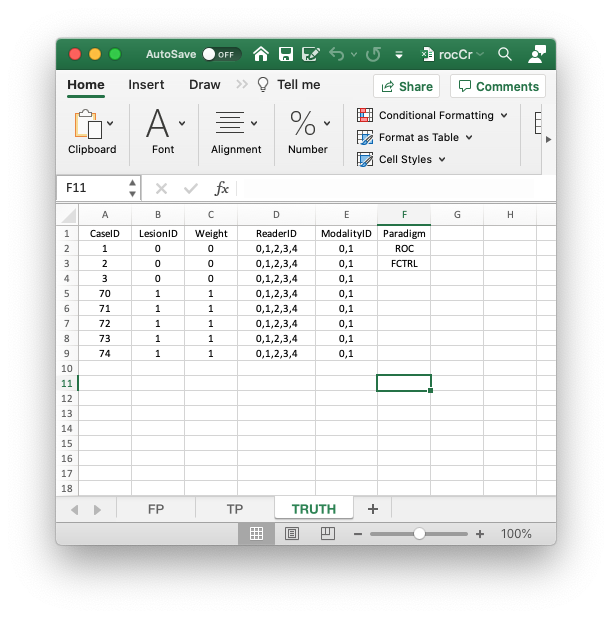

# (PART\*) Quick Start {-}


# ROC data format {#quick-start-roc}


```{r setup, include = FALSE}
knitr::opts_chunk$set(
  collapse = TRUE,
  comment = "#>"
)
library(RJafroc)
```


## How much finished 50% {#quick-start-roc-how-much-finished} 

(remove duplication)


## Introduction {#quick-start-roc-intro}

The JAFROC Excel data format was adopted circa. 2006. The purpose of this chapter is to explain the format of this file and how to read this file into a dataset object suitable for analysis using the `RJafroc` package.

In the ROC paradigm the observer assigns a rating to each image. A rating is an ordered numeric label, and, in our convention, higher values represent greater certainty or confidence for presence of disease. Location information associated with the disease, if applicable, is not collected.


## Note to existing users {#quick-start-roc-note}

* The Excel file format has recently undergone changes involving three additional columns in the `Truth` worksheet. These are needed for generalization to other data collection paradigms and for better data entry error control.

* `RJafroc` will work with original format Excel files provided the `NewExcelFileFormat` flag in `DfReadDataFile` is set to `FALSE`, which is the default (see following help page). 

* Going forward, one should use the new format, described below, and use `NewExcelFileFormat = TRUE` to read the file.

## Help page {#quick-start-roc-note}

```{r, echo=FALSE}

```

## Worksheets in the Excel file {#quick-start-roc-excel}

* The illustrations in this chapter are for Excel file `R/quick-start/rocCr.xlsx` in the project directory. I assume the reader has forked the `RJafrocQuickStart` repository. See Section \@ref(quick-start-index-how-to-access-files) for how to download all files and code in this `bookdown` book to your computer. 

* This is a *toy file*, i.e., a small made-up dataset used to illustrate essential features of the data format. 

* The Excel file has three worksheets: `Truth`, `NL` (or `FP`) and `LL` (or `TP`). The worksheet names are case insensitive.

{width=100%}

### The `Truth` worksheet {#quick-start-roc-truth}

The `Truth` worksheet shown above contains 6 columns: `CaseID`, `LesionID`, `Weight`, `ReaderID`, `ModalityID` and `Paradigm`. These names are case sensitive.

1. `CaseID`: **unique integers**, one per case, representing the cases in the dataset. In the current dataset, the non-diseased cases are labeled `1`, `2` and `3`, while the diseased cases are labeled `70`, `71`, `72`, `73` and `74`. The values do not have to be consecutive integers; they need not be ordered; the only requirement is that they be unique integers. It is recommended that small integers be used.

1. `LesionID`: integers 0 or 1, with each 0 representing a non-diseased case and each 1 representing a diseased case. 

1. `Weight`: this field is not used for ROC data. 

1. `ReaderID`: a **comma-separated** string containing the reader (i.e., radiologist or observer) labels, each represented by a **unique integer**, that have interpreted the case. In the example shown below each cell has the value `0, 1, 2, 3, 4` meaning each of these readers has interpreted all cases. With multiple readers each cell in this column has to be text formatted as otherwise Excel will not accept it. Select the worksheet, then `Format` - `Cells` - `Number` - `Text` - `OK`. It is highly recommended that small equal-length integers, properly ordered, be used, as  otherwise the output will not be aesthetically pleasing (the code will work, but the output will be harder to interpret). For example `0, 1, 2, 3, 4` is preferred to `00, 10, 20, 30, 40` and to `1, 3, 2, 0, 4`.
    
1. `ModalityID`: a comma-separated string containing the modality labels, each represented by a **unique integer**. In the example each cell has the value `0, 1` meaning this is a two-modality study. As above, with multiple modalities each cell has to be text formatted as otherwise Excel will not accept it. It is highly recommended that small equal-length integers, properly ordered, be used.
    
1. `Paradigm`: this column contains two cells, `ROC` and `FCTRL`. It means that this is an ROC dataset and the study design is factorial (or fully-crossed), i.e., each reader interprets each case in each modality. 


### Comments on the `Truth` worksheet {#quick-start-roc-truth-comments}

There are 5 diseased cases in the dataset (the number of 1's in the `LesionID` column of the `Truth` worksheet). There are 3 non-diseased cases in the dataset (the number of 0's in the `LesionID` column). There are 5 readers in the dataset (each cell in the `ReaderID` column contains the string `0, 1, 2, 3, 4`). There are 2 modalities in the dataset (each cell in the `ModalityID` column contains the string `0, 1`).


### The FP/NL worksheet {#quick-start-roc-fp}

{width=100%}

The FP/NL worksheet consists of 4 columns, each of length 30 (i.e., # of modalities x number of readers x number of non-diseased cases).  The (case sensitive) column names and meanings are as follows:

1. `ReaderID`: the reader labels: `0`, `1`, `2`, `3` and `4`. Each reader label occurs 6 times (i.e., # of modalities x number of non-diseased cases). 

1. `ModalityID`: the modality or treatment labels: `0` and `1`. Each label occurs 15 times (i.e., # of readers x number of non-diseased cases). 

1. `CaseID`: the case labels for non-diseased cases: `1`, `2` and `3`. Each label occurs 10 times (i.e., # of modalities x # of readers). The label of a diseased case cannot occur in the FP worksheet. If it does the software generates an error. 

1. `FP_Rating`: the (floating point) ratings of non-diseased cases. Each row of this worksheet contains a rating corresponding to the values of `ReaderID`, `ModalityID` and `CaseID` for that row.  


### The TP/LL worksheet {#quick-start-roc-tp}

{width=100%}

The TP/LL worksheet consists of 5 columns, each of length 50 (i.e., # of modalities x number of readers x number of diseased cases). The (case sensitive) column names and meanings are as follows:

1. `ReaderID`: the reader labels: `0`, `1`, `2`, `3` and `4`. Each reader label occurs 10 times (i.e., # of modalities x number of diseased cases). 

1. `ModalityID`: the modality or treatment labels: `0` and `1`. Each label occurs 25 times (i.e., # of readers x number of diseased cases). 

1. `LesionID`: For an ROC dataset this column contains fifty 1's (each diseased case has one lesion). 

1. `CaseID`: the case labels for non-diseased cases: `70`, `71`, `72`, `73` and `74`. Each label occurs 10 times (i.e., # of modalities x # of readers). For an ROC dataset the label of a non-diseased case cannot occur in the TP worksheet. If it does the software generates an error. 

1. `TP_Rating`: the (floating point) ratings of diseased cases. Each row of this worksheet contains a rating corresponding to the values of `ReaderID`, `ModalityID`, `LesionID` and `CaseID` for that row.   


## Reading the Excel file {#quick-start-roc-read}

The following code uses the function `DfReadDataFile` to read the Excel file and save it to object `x`.

```{r}
x <- DfReadDataFile("R/quick-start/rocCr.xlsx", newExcelFileFormat = TRUE)
```             

*  `newExcelFileFormat` is set to `TRUE` as otherwise columns D - F in the `Truth` worksheet are ignored and the dataset is assumed to be factorial, with `dataType` "automatically" determined from the contents of the FP and TP worksheets. ^[The assumptions underlying the "automatic" determination could be defeated by data entry errors.]

*  Flag `newExcelFileFormat = FALSE`, the default, is for compatibility with the original JAFROC format Excel format, which did not have columns D - F in the `Truth` worksheet. Its usage is deprecated.


## Structure of dataset object {#quick-start-roc-structure-dataset}

Most users will not need to be concerned with the internal structure of the dataset object `x`. For those interested in it, for my reference, and for ease of maintenance of the software, this is deferred to Section \@ref(dataset-object-details-structure-roc-dataset).

