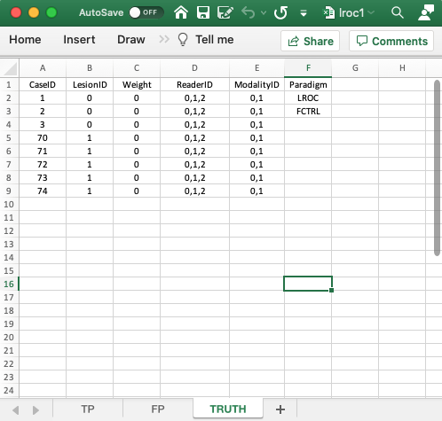
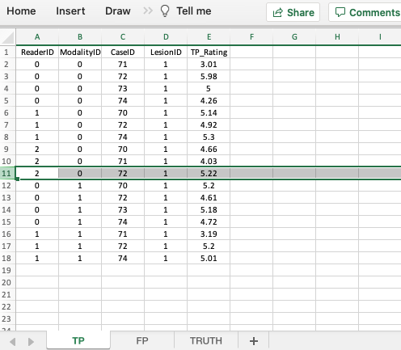

# LROC data format {#quick-start-lroc}


```{r setup, include = FALSE}
knitr::opts_chunk$set(
  collapse = TRUE,
  comment = "#>"
)
library(RJafroc)
```


## How much finished 75% {#quick-start-lroc-data-how-much-finished}


## Introduction {#quick-start-lroc-data-intro}

In the Localization Receiver Operating Characteristic (LROC) paradigm [@starr1977comments; @starr1975visual; @swensson1996unified] the observer assigns an overall ROC-rating to each case and marks the most suspicious region in each case. Additionally, each diseased case has *exactly* one lesion. On a diseased case and if the mark is close to the real lesion, the mark is scored as a correct-localization (`CL`) and otherwise it is scored as an incorrect-localization (`IL`). On a non-diseased case the mark is always classified as a false-positive (`FP`). 

The paradigm is illustrated with two toy data files, `R/quick-start/lroc1.xlsx` and `R/quick-start/lroc2.xlsx`. These files illustrate two-modality three-reader LROC datasets with 3 non-diseased and 5 diseased cases. 

* File `R/quick-start/lroc1.xlsx` illustrates the classic (i.e., as originally introduced) LROC paradigm where *one mark per case is forced/required*. 

* File `R/quick-start/lroc2.xlsx` illustrates the paradigm when one mark-rating pair per case is not forced. There is some history behind this: the basic issue was what was the observer supposed to do when there there was nothing to report. Swensson initially thought that even if there was nothing to report, there must be a region, selected from the set of very low confidence regions, which was most likely to be a lesion (like the maximum of the set of minimums). Most radiologists had difficulty with the forced localization requirement - if they see nothing suspicious, why should they be forced to mark a most suspicious location. The paradigm was subsequently altered so that if the confidence level was below a certain value, say 12 percent on a 0 to 100 scale, the radiologist did not have to report a location. LROCFIT software was modified accordingly, and internal to the software the mark was assigned a random location - which ended up being classified as an incorrect-localization in most cases.


## `Truth` worksheet {#quick-start-lroc-truth}


```{r quick-start-lroc-truth, echo=FALSE, out.width="100%",fig.cap="The Truth worksheet for LROC Excel file `R/quick-start/lroc1.xlsx`",fig.show='hold',fig.align='center'}

``` 


* The `Truth` worksheet is similar to that described previously for the ROC and FROC paradigms. The only difference is the first entry in the Paradigm column, which is `LROC`.
* Since a diseased case has one lesion, the first five columns contain as many rows as there are cases in the dataset. There being 8 cases in the dataset, there are 8 rows of data.
* `CaseID`: unique **integers** representing the cases in the dataset: '1', '2', '3', the 3 non-diseased cases, and '70', '71', '72', '73', '74', the 5 diseased cases.   
* `LesionID`: integers 0 or 1. 
    + Each 0 represents a non-diseased case, 
    + Each 1 represents the sole lesion in the diseased case. 
* There are 3 non-diseased cases in the dataset (the number of 0's in the `LesionID` column).
* There are 5 diseased cases in the dataset (the number of 1's in the `LesionID` column). 
* `Weight`: this column is filled with zeroes. As with the ROC paradigm, with one lesion per case the weights are irrelevant.
* `ReaderID`: In the example shown each cell has the value '0, 1, 2'. There are 3 readers in the dataset, labeled `0`, `1` and `2`.
* `ModalityID`: In the example each cell has the value `0, 1`. There are 2 modalities in the dataset, labeled `0` and `1`.
* `Paradigm`: The contents are `LROC` and `FCTRL`: this is an `LROC` dataset and the design is "factorial".


## `TP` worksheet, forced localization true {#quick-start-lroc-tp1}


```{r quick-start-lroc-tp1, echo=FALSE, out.width="100%",fig.cap="The TP worksheet for forced localization true LROC Excel file `R/quick-start/lroc1.xlsx`",fig.show='hold',fig.align='center'}
knitr::include_graphics("images/quick-start/lroc1TP.png")
``` 


* The `TP` worksheet is similar to that described previously for the ROC and FROC paradigms.
* However, in the LROC paradigm this worksheet records correct localizations only.
* This worksheet can only have diseased cases. The presence of a non-diseased case in this worksheet will generate an error.
* The key difference is that for each modality-reader-diseased-case there can be at most one entry. Also, if a particular combination is missing in the TP worksheet then it must appear in the FP worksheet. This is because this is a forced-mark-per-case dataset.
* There can be at most 30 rows of data in this worksheet: 2 modalities times 3 readers times 5 diseased cases. Since there in fact only 17 rows of data, the missing 13 rows must occur in the FP worksheet.
* Recall that each entry in the TP worksheet represents a correct localization while each missing entry represents an incorrect localization. The incorrect localizations are recorded in the FP worksheet.


## `FP` worksheet, forced localization true {#quick-start-lroc-fp1}


```{r quick-start-lroc-fp1, echo=FALSE, out.width="50%",fig.cap="The FP worksheet for forced localization LROC Excel file `R/quick-start/lroc1.xlsx`",fig.show='hold',fig.align='center'}
knitr::include_graphics(c("images/quick-start/lroc1FP1.png", "images/quick-start/lroc1FP2.png"))
``` 


* The `FP` worksheet is similar to that described previously for the ROC and FROC paradigms. 
* Because of the forced mark requirement, there are 18 rows of data corresponding to non-diseased cases: 2 modalities times 3 readers times 3 non-diseased cases. The missing 13 rows from the TP worksheet are listed next; these correspond to the incorrect localizations on diseased cases. Therefore, the total number of rows in this worksheet is 18 + 13 = 31.
* As an example, it is seen that for `modalityID` = 0 and `readerID` = 0, `caseID` = 70 does not appear in the TP worksheet. The lesion on this case was not correctly localized; therefore it appears in the FP worksheet as an incorrect localization.
* As another example, for `modalityID` = 0 and `readerID` = 1, `caseID` = 71 does not appear in the TP worksheet; instead it appears in the FP worksheet.
* As a final example, for `modalityID` = 1 and `readerID` = 2, none of the diseased cases appears in the TP worksheet; instead they all appear in the FP worksheet.


## Reading forced localization true LROC dataset {#quick-start-lroc-data-1}

The images shown above correspond to file `R/quick-start/lroc1.xlsx`. The next code reads this file into an `R` object `ds1`. Note the usage of the `lrocForcedMark` flag, which is set to `TRUE`, because this is a forced localization LROC dataset. 

```{r}
lroc1 <- "R/quick-start/lroc1.xlsx"
ds1 <- DfReadDataFile(lroc1, newExcelFileFormat = TRUE, lrocForcedMark = T)
str(ds1)
```             

This follows the general description in Chapter \@ref(quick-start-roc). The differences are described below.

* `ds1$ratings$NL` is a [2,3,8,1] dimension vector. For each modality and reader, only the first three elements, corresponding to the three non-diseased cases, are finite, the rest are `-Inf`.

For example:

```{r}
ds1$ratings$NL[1,1,,1]
```             

* `ds1$ratings$LL` is a [2,3,5,1] dimension vector. For each modality and reader, only the first three elements, corresponding to the three non-diseased cases, are finite, the rest are `-Inf`.

For example, since none of the lesions are localized for `modalityID` = 1 (second modality) and `readerID` = 2 (third reader), the following code yields a vector consisting of five `-Inf` values:

```{r}
ds1$ratings$LL[2,3,,1]
```             

* `ds1$ratings$LL_IL` is a [2,3,5,1] dimension vector. These contain the ratings of incorrect localizations on diseased cases. For the just preceding modality-reader combination, this yields a vector with 5 finite values, the ratings of incorrect localizations for `modalityID` = 1 and `readerID` = 2.

```{r}
ds1$ratings$LL_IL[2,3,,1]
```             


## `TP` worksheet, forced localization false {#quick-start-lroc-tp2}


```{r quick-start-lroc-tp2, echo=FALSE, out.width="100%",fig.cap="The TP worksheet for forced localization false LROC Excel file `R/quick-start/lroc2.xlsx`",fig.show='hold',fig.align='center'}

``` 


## `FP` worksheet, forced localization false {#quick-start-lroc-fp2}


```{r quick-start-lroc-fp2, echo=FALSE, out.width="50%",fig.cap="The FP worksheet for forced localization false LROC Excel file `R/quick-start/lroc2.xlsx`",fig.show='hold',fig.align='center'}
knitr::include_graphics(c("images/quick-start/lroc2FP1.png", "images/quick-start/lroc2FP2.png"))
``` 


* If a particular modality-reader-case combination is missing in the TP worksheet then it need not appear in the FP worksheet. This is because this is not a forced-mark-per-case dataset.
* As an example, `modalityID` = 1, `readerID` = 2 and `caseID` = 74 does not appear in either TP or FP worksheets.


## Reading forced localization false LROC dataset {#quick-start-lroc-data-2}

The next example is for file `R/quick-start/lroc2.xlsx`. The following code reads this file into an `R` object `x2`. Note that for this dataset one must set the `lrocForcedMark` flag to `FALSE`, because this is *not* a forced localization LROC dataset. Setting `lrocForcedMark` flag to `TRUE` will generate an error.

```{r}
lroc2 <- "R/quick-start/lroc2.xlsx"
x2 <- DfReadDataFile(lroc2, newExcelFileFormat = TRUE, lrocForcedMark = F)
str(x2)
```             

* The `x2$ratings$LL` array is a [2,3,5,1] dimension vector. For each modality and reader, only the first three elements, corresponding to the three non-diseased cases, are finite, the rest are `-Inf`.

For example, since none of the lesions are localized for `modalityID` = 1 (second modality) and `readerID` = 2 (third reader), the following code yields a vector consisting of five `-Inf` values:

```{r}
x2$ratings$LL[2,3,,1]
```             

* The `x2$ratings$LL_IL` is a [2,3,5,1] dimension vector. These contain the ratings of incorrect localizations on diseased cases. For the just preceding modality-reader combination, this yields a vector with 4 finite values, the ratings of incorrect localizations for `modalityID` = 1 and `readerID` = 2.

```{r}
x2$ratings$LL_IL[2,3,,1]
```             

For this modality-reader combination case 74 (i.e., the fifth diseased case) was unmarked. It does not appear in either the TP or the FP worksheet.

## Summary {#quick-start-lroc-data-summary}

The difference from the previous data structures is the existence of `LL_IL` in the `ratings` list, which contains the ratings of incorrect localizations. Recall that for ROC and FROC paradigms this member was `NA`. When the data obeys forced localization, the corresponding flag should be set to `TRUE`, otherwise it should be set to `FALSE`. The default value of this flag is `NA`, which will work for ROC or FROC datasets. For LROC datasets it should be set to `T/F`.


