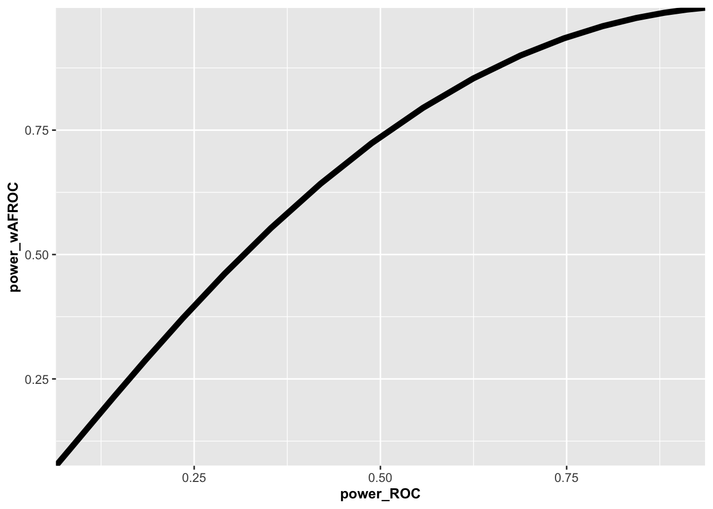
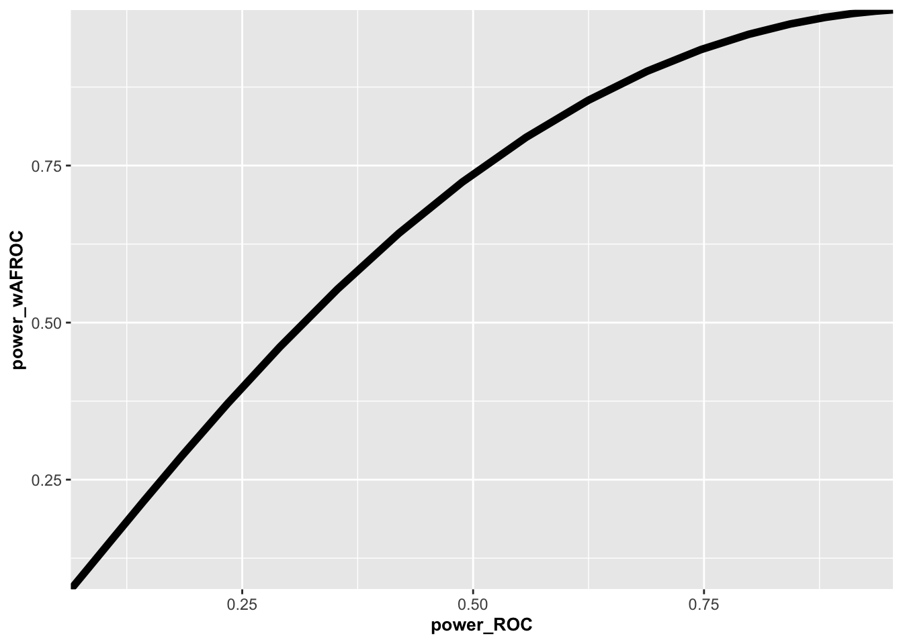

# (PART\*) FROC sample size {-}


# FROC sample size estimation {#froc-sample-size}


```r
source(here("R/froc-sample-size/frocSampleSize.R"))
```

## How much finished 40 percent {#froc-sample-size-how-much-finished}

Need to change to OR method

## Overview

This chapter is split into two parts: 

* The first part details a step-by-step approach to FROC paradigm sample size estimation; 

* The second part encapsulates some of the details in function `SsFrocNhRsmModel()`.


## Part 1

### Introduction {#froc-sample-size-intro}

FROC sample size estimation is not fundamentally different from ROC sample size estimation, Chapter \@ref(roc-sample-size-dbm). 

**A recapitulation of ROC sample size estimation** 

Based on analysis of a pilot ROC dataset and using a specified figure of merit (FOM), e.g., `FOM = Wilcoxon`, and either `method = "DBM"` or `method = "OR"` for significance testing, one estimates the intrinsic variability of the data expressed in terms of FOM variance components. For the DBM method these are the pseudovalue-based variance components while for OR method these are the FOM-based variance and covariances. **In this chapter the OR variance components will be used.** The second step is to specify a clinically realistic effect-size, e.g., the anticipated AUC difference between the two modalities. 

Given the variance components and the anticipated AUC difference the sample size functions (`RJafroc` function names beginning with `Ss`) allow one to estimate the number of readers and cases necessary to detect (i.e., reject the null hypothesis) the modality AUC difference with probability $\beta$, typically chosen to be 20 percent (corresponding to 80 percent statistical power) while maintaining the NH (zero AUC difference) rejection rate probability at $\alpha$, typically chosen to be 5 percent. 


**Summary of FROC sample size estimation** 

In FROC analysis the only difference, indeed the critical difference, is the choice of FOM; e.g., `FOM = "wAFROC"` instead of the ROC-AUC, `FOM = "Wilcoxon"`. The FROC dataset is analyzed using the DBM (or the OR) method. This yields the necessary variance components (or the covariance matrix) of the wAFROC-AUC. Next one specifies the effect-size **in wAFROC-AUC units** and this requires care. The ROC-AUC has a historically well-known interpretation, namely it is the classification ability at separating diseased patients from non-diseased patients, while the wAFROC-AUC does not. Needed is a way of relating the effect-size in easily understood ROC-AUC units to one in wAFROC-AUC units. This requires a physical model, e.g., the RSM, that predicts both ROC and wAFROC curves and their corresponding AUCs.


1.	One chooses an ROC-AUC effect-size that is realistic, one that clinicians understand and can therefore participate in, in the effect-size postulation process. Lacking such information I recommend, based on past ROC studies, 0.03 as typical of a small effect size and 0.05 as typical of a moderate effect size.

2.	One converts the ROC effect-size to a wAFROC-AUC effect-size using the method described in the next section.

3.	One uses the sample size tools in `RJafroc` to determine sample size for a desired statistical power. 


>**It is important to recognize is that all quantities have to be in the same units**. When performing ROC analysis, everything (variance components and effect-size) has to be in units of the selected FOM, e.g., `FOM = "Wilcoxon"`. When doing wAFROC analysis, everything has to be in units of the wAFROC-AUC, i.e., `FOM = "wAFROC"`. The variance components and effect-size in wAFROC-AUC units will be different from their corresponding ROC counterparts. In particular, as shown next, an ROC-AUC effect-size of 0.05 generally corresponds to a larger effect-size in wAFROC-AUC units. The reason for this is that the range over which wAFROC-AUC can vary, namely 0 to 1, is twice the corresponding ROC-AUC range (0.5 to 1). For the same reason the wAFROC variance components also tend to be larger than the ROC variance components.


The next section explains the steps used to implement #2 above. 

### Relating ROC and wAFROC effect-sizes

The steps are illustrated using `dataset04`, a 5 treatment, 4 radiologist and 200 case FROC dataset [@zanca2009evaluation] acquired on a 5-point scale, i.e., the data is already binned. If not binned one needs to bin the dataset using `DfBinDataset()` before RSM fitting can be performed. 

The following code computes `JStar` and `KStar`, the numbers of readers and cases in the pilot dataset. These are needed below for correct scaling of the OR variance components.


```r
JStar <- length(dataset04$ratings$NL[1,,1,1])
KStar <- length(dataset04$ratings$NL[1,1,,1])
```

#### Extract NH treatments

If there are more than two treatments in the pilot dataset, as in `dataset04`, one extracts those treatments that represent "almost" null hypothesis data (in the sense of similar ROC-AUCs): 


```r
frocDataNH <- DfExtractDataset(dataset04, trts = c(1,2))
```

extracts treatments 1 and 2. These treatments were found [@zanca2009evaluation] to be "almost" equivalent (the NH could not be rejected for the wAFROC-AUC difference between these treatments). More than two treatments can be used if they have similar AUCs, as this will improve the stability of the procedure. However, the final sample size predictions are restricted to two treatments in the pivotal study. 


The next two steps are needed since **the RSM can only fit binned ROC data**. 


#### Convert the FROC NH data to ROC

If the original data is FROC, one converts it to ROC:


```r
rocDataNH <- DfFroc2Roc(frocDataNH)
```

#### Bin the data

If the NH dataset uses continuous ratings one bins the ratings: 


```r
# For dataset04 this is unnecessary as it is already binned but it can't hurt
rocDataBinNH <- DfBinDataset(rocDataNH, opChType = "ROC")
```

The default number of bins should be used. Unlike binning using arbitrarily set thresholds the thresholds found by `DfBinDataset()` are unique as they maximize the empirical ROC-AUC. 


#### Determine the lesion distribution and weights of the FROC dataset


`lesDistr` is the lesion distribution, see Section \@ref(quick-start-froc-data-lesion-distribution) and line 1 of the following code. The RSM fitting algorithm needs to know how lesion-rich the dataset is as the predicted ROC-AUC depends it. For this dataset fraction 0.69 of diseased cases have one lesion, fraction 0.2 have two lesions and fraction 0.11 have three lesions. One also needs the lesion weights matrix, $\textbf{W}$, see Section \@ref(quick-start-froc-data-lesion-weights). The call at line 2 to `UtilLesWghtsDS` uses the default argument `relWeights = 0` which assigns equal weights to all lesions.


```{.r .numberLines}
lesDistr <- UtilLesDistr(frocDataNH)
W <- UtilLesWghtsDS(frocDataNH)
W
```

```
##      [,1]      [,2]      [,3]      [,4]
## [1,]    1 1.0000000      -Inf      -Inf
## [2,]    2 0.5000000 0.5000000      -Inf
## [3,]    3 0.3333333 0.3333333 0.3333333
```


Note that `lesDistr` and $\textbf{W}$ are determined from the *FROC* NH dataset as this information is lost upon conversion to an ROC dataset. 

#### Fit the RSM to the ROC data

For each treatment and reader the fitting algorithm `FitRsmRoc()` is applied (lines 4 - 11) to the binned NH ROC dataset. The returned values are `mu`, `lambda` and `nu`, corresponding to the physical RSM parameters ${\mu}$, ${\lambda}$ and ${\nu}$.


```{.r .numberLines}
I <- dim(rocDataBinNH$ratings$NL)[1]
J <- dim(rocDataBinNH$ratings$NL)[2]
RsmParmsNH <- array(dim = c(I,J,3))
for (i in 1:I) {
  for (j in 1:J)  {
    fit <- FitRsmRoc(rocDataBinNH, trt = i, rdr = j, lesDistr$Freq)
    RsmParmsNH[i,j,1] <- fit[[1]] # mu
    RsmParmsNH[i,j,2] <- fit[[2]] # lambda
    RsmParmsNH[i,j,3] <- fit[[3]] # nu
  }
}
```


#### Compute the median values of the RSM parameters

I recommend taking the median (not the mean) of each of the parameters as representing the "average" NH dataset. The median is less sensitive to outliers than the mean.  


```r
muNH <- median(RsmParmsNH[,,1]) 
lambdaNH <- median(RsmParmsNH[,,2])
nuNH <- median(RsmParmsNH[,,3])
```


The defining values of the NH fitting model are `muNH` = 3.3121519, `lambdaNH` = 1.714368 and `nuNH` = 0.7036564. 


#### Compute ROC and wAFROC NH AUCs


```r
aucRocNH <- UtilAnalyticalAucsRSM(muNH, lambdaNH, nuNH, lesDistr = lesDistr$Freq)$aucROC
aucwAfrocNH <- UtilAnalyticalAucsRSM(muNH, lambdaNH, nuNH, lesDistr = lesDistr$Freq)$aucwAFROC
```


The AUCs are: `aucRocNH = 0.8791542` and `aucwAfrocNH = 0.7198615`. Note that the wAFROC-FOM is smaller than the ROC-FOM as it includes detection and localization performance. 

#### Compute ROC and wAFROC AH AUCs for a range of ROC-AUC effect sizes

To define the alternative hypothesis (AH) condition, one increments $\mu_{NH}$ by $\Delta_{\mu}$. The resulting ROC-AUC and wAFROC-AUC are calculated. One calculates the effect size (AH value minus NH value) using ROC and wAFROC FOMs for a series of specified `deltaMu` values. This generates values that can be used to relate the wAFROC effect size for a specified ROC effect size. 


```r
deltaMu <- seq(0.01, 0.2, 0.01) # values of deltaMu to scan below
esRoc <- array(dim = length(deltaMu));eswAfroc <- array(dim = length(deltaMu))
for (i in 1:length(deltaMu)) {
  esRoc[i] <- UtilAnalyticalAucsRSM(
    muNH + deltaMu[i], lambdaNH, nuNH, lesDistr = lesDistr$Freq)$aucROC - aucRocNH
  eswAfroc[i] <- UtilAnalyticalAucsRSM(
    muNH+ deltaMu[i], lambdaNH, nuNH, lesDistr = lesDistr$Freq)$aucwAFROC - aucwAfrocNH
}
```


Here is a plot of wAFROC effect size (y-axis) vs. ROC effect size.


<div class="figure" style="text-align: center">

<p class="caption">(\#fig:unnamed-chunk-12)Plot of wAFROC effect size vs. ROC effect size. The straight line fit through the origin has slope 1.2620812.</p>
</div>


The plot is linear and the intercept is close to zero. This makes it easy to implement an interpolation function. In the following code line 1 fits `eswAfroc` vs. `esRoc` using a linear model `lm()` function constrained to pass through the origin (the "-1"). One expects this constraint since for `deltaMu = 0` the effect size must be zero no matter how it is measured. 


```{.r .numberLines}
scaleFactor<-lm(eswAfroc ~ -1 + esRoc) # the "-1" fits to straight line through the origin
effectSizeROC <- seq(0.01, 0.105, 0.005) # length 20 vector
effectSizewAFROC <- effectSizeROC*scaleFactor$coefficients[1]
```


The slope of the zero-intercept constrained straight line fit is `scaleFactor` = 1.262 and the squared correlation coefficient is `R2` = 0.9999997 (the fit is very good). Therefore, the conversion from ROC to wAFROC effect size is: 

```
effectSizewAFROC = scaleFactor * effectSizeROC
```

**For this dataset the wAFROC effect size is 1.262 times the ROC effect size.** The wAFROC effect size is expected to be larger than the ROC effect size because the range of wAFROC-AUC, $1-0=1$, is twice that of ROC-AUC, $1-0.5=0.5$.


### ROC and wAFROC variance components

The following skeleton code shows the arguments of the function `UtilVarComponentsOR` used to calculate the OR variance components.

```
UtilVarComponentsOR(
  dataset,
  FOM,
  FPFValue = 0.2,
  covEstMethod = "jackknife",
  nBoots = 200,
  seed = NULL
)
```

`UtilVarComponentsOR()` is applied to `rocDataNH` and `frocDataNH` (using "Wilcoxon" and "wAFROC" FOMs respectively) followed by the extraction of the two OR variance components.


```{.r .numberLines}
varComp_roc <- UtilVarComponentsOR(
  rocDataNH, 
  FOM = "Wilcoxon")$VarCom[-2]

varComp_wafroc <- UtilVarComponentsOR(
  frocDataNH, 
  FOM = "wAFROC")$VarCom[-2]
```


VarCom[-2] removes the second column of each dataframe containing the correlations. The ROC and wAFROC variance components are:


```
##                ROC        wAFROC
## VarR  0.0008277380  0.0018542289
## VarTR 0.0001526507 -0.0004439279
## Cov1  0.0002083377  0.0003736844
## Cov2  0.0002388384  0.0003567162
## Cov3  0.0001906167  0.0003058902
## Var   0.0007307912  0.0009081383
```


### ROC and wAFROC power for equivalent effect-sizes

We compare ROC and wAFROC random-reader random-case (RRRC) powers for equivalent effect sizes.  


```{.r .numberLines}
# these are OR variance components assuming FOM = "Wilcoxon"
varR_roc <- varComp_roc["VarR","Estimates"]
varTR_roc <- varComp_roc["VarTR","Estimates"]
Cov1_roc <- varComp_roc["Cov1","Estimates"]
Cov2_roc <- varComp_roc["Cov2","Estimates"]
Cov3_roc <- varComp_roc["Cov3","Estimates"]
Var_roc <- varComp_roc["Var","Estimates"]

# these are OR variance components assuming FOM = "wAFROC"
varR_wafroc <- varComp_wafroc["VarR","Estimates"]
varTR_wafroc <- varComp_wafroc["VarTR","Estimates"]
Cov1_wafroc <- varComp_wafroc["Cov1","Estimates"]
Cov2_wafroc <- varComp_wafroc["Cov2","Estimates"]
Cov3_wafroc <- varComp_wafroc["Cov3","Estimates"]
Var_wafroc <- varComp_wafroc["Var","Estimates"]

power_roc <- array(dim = length(effectSizeROC))
power_wafroc <- array(dim = length(effectSizeROC))

JPivot <- 5;KPivot <- 100
for (i in 1:length(effectSizeROC)) {
  
  # compute ROC power
  ret <- SsPowerGivenJK(
    dataset = NULL, 
    FOM = "Wilcoxon", 
    J = JPivot, 
    K = KPivot, 
    effectSize = effectSizeROC[i], 
    list(JStar = JStar, KStar = KStar, 
         VarTR = varTR_roc,
         Cov1 = Cov1_roc,
         Cov2 = Cov2_roc,
         Cov3 = Cov3_roc,
         Var = Var_roc))
  power_roc[i] <- ret$powerRRRC
  
  # compute wAFROC power
  ret <- SsPowerGivenJK(
    dataset = NULL, 
    FOM = "wAFROC", 
    J = JPivot, 
    K = KPivot, 
    effectSize = effectSizewAFROC[i], 
    list(JStar = JStar, KStar = KStar, 
         VarTR = varTR_wafroc,
         Cov1 = Cov1_wafroc,
         Cov2 = Cov2_wafroc,
         Cov3 = Cov3_wafroc,
         Var = Var_wafroc))
  power_wafroc[i] <- ret$powerRRRC
  
}
```


Lines 2-4 extract the variance components using the ROC-AUC figure of merit. Lines 7-9 extract the variance components using the wAFROC-AUC figure of merit. These are passed to `SsPowerGivenJK` at lines 27 and 30, respectively. Line 14 defines the number of readers and cases in the pivotal study. The for-loop calculates ROC power (line 28) and wAFROC power (line 31).

Since the wAFROC effect size is 1.26 times the ROC effect size, wAFROC power is larger than that for ROC. For example, for ROC effect size = 0.06 the wAFROC effect size is 0.075724872, the ROC power is 0.55738123 while the wAFROC power is 0.79517494. The effect size difference is magnified as it enters as the square in the formula for statistical power: this overwhelms the increase, noted previously, in variability of wAFROC-AUC relative to ROC-AUC 

The following is a plot of the respective powers.


<div class="figure" style="text-align: center">

<p class="caption">(\#fig:unnamed-chunk-17)Plot of wAFROC power vs. ROC power. For ROC effect size = 0.06 the wAFROC effect size is 0.075724872, the ROC power is 0.55738123 while the wAFROC power is 0.79517494.</p>
</div>


## Part 2

### Introduction

This example uses the FED dataset as a pilot FROC study and function `SsFrocNhRsmModel()` to construct the NH model (encapsulating some of the code in the first part).


### Constructing the NH model for the dataset

One starts by extracting the first two treatments from `dataset04`, which represent the NH dataset. Next one constructs the NH model. `lesDistr` can be specified independent of that in the pilot dataset. This allows some control over selection of the diseased cases in the pivotal study. However, in this example it is simply extracted from the pilot dataset (line 2). Line 3 applies the function `SsFrocNhRsmModel` to calculate the NH RSM parameters and the scale factor.


```{.r .numberLines}
frocNhData <- DfExtractDataset(dataset04, trts = c(1,2))
lesDistr <- UtilLesDistr(frocNhData) # this can be replaced by the anticipated lesion distribution
ret <- SsFrocNhRsmModel(frocNhData, lesDistr = lesDistr$Freq)
muNH <- ret$mu
lambdaNH <- ret$lambda
nuNH <- ret$nu
scaleFactor <- ret$scaleFactor
```


The fitting model is defined by `muNH` = 3.3121519,  `lambdaNH` = 1.714368  and  `nuNH` = 0.7036564 and `lesDistr$Freq` = 0.69, 0.2, 0.11. The effect size scale factor is `scaleFactor` = 1.2617239. All of these are identical to the Part I values.


### Extract the wAFROC variance components  {#froc-sample-size-variance-components}

The code applies `StSignificanceTesting()` to `frocNhData`, using `FOM = "wAFROC"` and extracts the variance components.


```r
varComp_wafroc  <- StSignificanceTesting(
  frocNhData, 
  FOM = "wAFROC", 
  method = "OR", 
  analysisOption = "RRRC")$ANOVA$VarCom
```


### wAFROC power for specified ROC effect size, number of readers and number of cases

The following example is for ROC effect size = 0.05, 5 readers (`J = 5`) and 100 cases (`K = 100`) in the **pivotal study**. 

```
SsPowerGivenJK(
  dataset,
  ...,
  FOM,
  J,
  K,
  effectSize = NULL,
  alpha = 0.05
)
```

The function `SsPowerGivenJK` used below returns the power for specified effect size, numbers of readers and cases, and variance components (supplied as a `list` via the `...` argument   - see TBA lines xx and yy of following code). The default arguments of this function are: 

```
method = "OR" 
analysisOption = "RRRC" 
LegacyCode = FALSE
```


```{.r .numberLines}
effectSizeROC <- 0.05
effectSizewAFROC <- scaleFactor * effectSizeROC

J <- 5;K <- 100 # define pivotal study sample size

ret <- SsPowerGivenJK(
  dataset = NULL, 
  FOM = "wAFROC", 
  J = J, 
  K = K, 
  effectSize = effectSizewAFROC, 
    list(JStar = JStar, KStar = KStar, 
         VarTR = varTR_wafroc,
         Cov1 = Cov1_wafroc,
         Cov2 = Cov2_wafroc,
         Cov3 = Cov3_wafroc,
         Var = Var_wafroc))
power_wafroc <- ret$powerRRRC

cat("ROC-ES = ", effectSizeROC, 
    ", wAFROC-ES = ", effectSizeROC * scaleFactor, 
    ", Power-wAFROC = ", power_wafroc, "\n")
```

```
## ROC-ES =  0.05 , wAFROC-ES =  0.063086196 , Power-wAFROC =  0.6420946
```


### Number of cases for 80 percent power for a given number of readers

```
SsSampleSizeKGivenJ(
  dataset,
  ...,
  J,
  FOM,
  effectSize = NULL,
  alpha = 0.05,
  desiredPower = 0.8,
)
```

The function `SsSampleSizeKGivenJ` returns the number of cases needed for desired power = 0.8 for wAFROC effect size as just listed and wAFROC variance components computed in Section \@ref(froc-sample-size-variance-components).


```{.r .numberLines}
ret2 <- SsSampleSizeKGivenJ(
  dataset = NULL, 
  J = 6, 
  effectSize = effectSizewAFROC, 
  list(JStar = JStar, KStar = KStar, 
       VarTR = varTR_wafroc,
       Cov1 = Cov1_wafroc,
       Cov2 = Cov2_wafroc,
       Cov3 = Cov3_wafroc,
       Var = Var_wafroc))

cat("ROC-ES = ", effectSizeROC, 
    ", wAFROC-ES = ", effectSizeROC * scaleFactor, 
    ", K80RRRC = ", ret2$KRRRC, 
    ", Power-wAFROC = ", ret2$powerRRRC, "\n")
```

```
## ROC-ES =  0.05 , wAFROC-ES =  0.063086196 , K80RRRC =  121 , Power-wAFROC =  0.80022333
```


## Discussion

This chapter has described the procedure for FROC sample size estimation.


## TBA Appendix

This is an application to another dataset, this time projecting from a pilot ROC dataset to a pivotal FROC study. Consider `dataset02`, the Van Dyke ROC dataset. It consists of 114 cases, 45 of which are diseased, interpreted in two treatments by five radiologists using the ROC paradigm. 


```r
#frocSampleSize(dataset06, J = 5, K = 100, lesDistr = UtilLesDistr(dataset06), effectSizeROC = 0.05)
#frocSampleSize(dataset01, J = 5, K = 100, effectSizeROC = 0.05)
```


