# CBM plots {#cbm-plots}


---
title: "RJafroc Vignette 7: CBM plots"
author: "Dev P. Chakraborty, PhD"
date: "2022-07-27"
output: rmarkdown::html_vignette
fig_caption: yes
fig.width: 4
vignette: >
  %\VignetteIndexEntry{CBM plots}
  %\VignetteEngine{knitr::rmarkdown}
  %\VignetteEncoding{UTF-8}
---
  


## Helper functions


## Main code and output
  

```
#> Fig. A : mu =  1 , alpha =  0.2
#> Fig. B : mu =  3 , alpha =  0.2
#> Fig. C : mu =  1 , alpha =  0.8
#> Fig. D : mu =  3 , alpha =  0.8
```

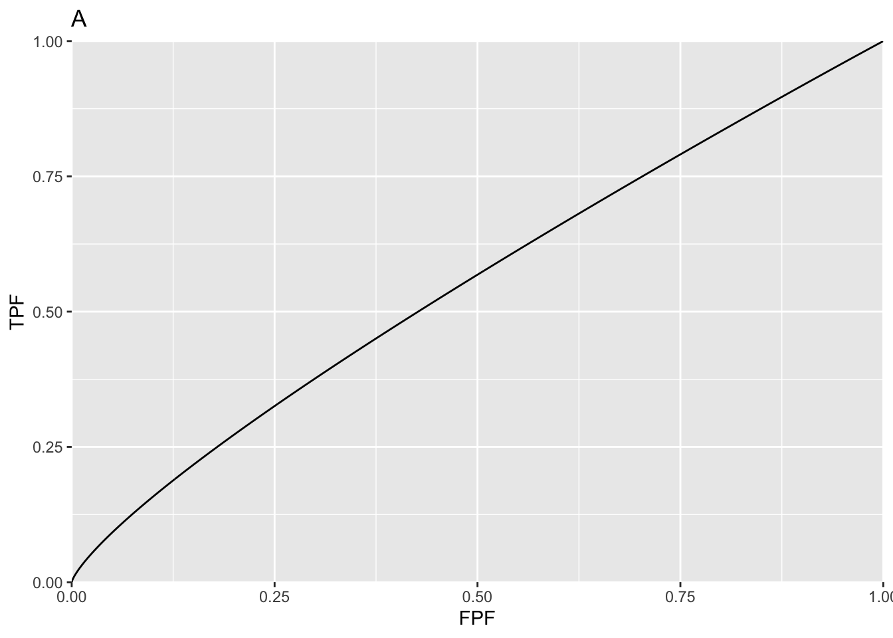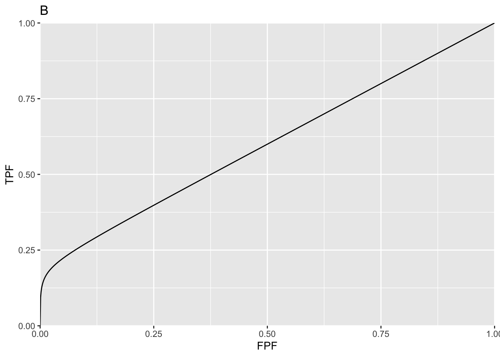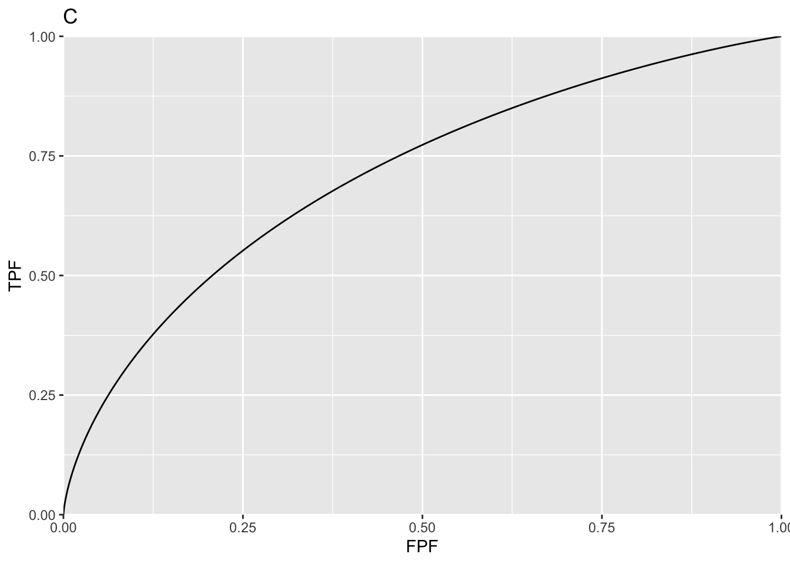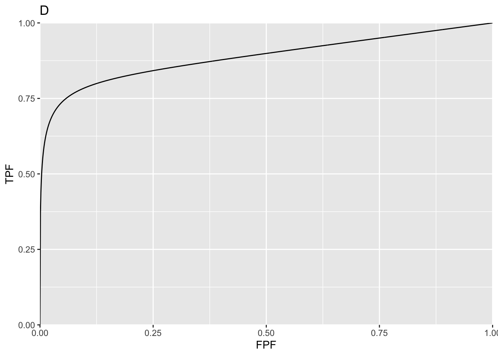


## Comments
Plots A - D show ROC curves predicted by the CBM model; the corresponding values of the $mu$ and $alpha$ parameters are indicated above the plots. For small $mu$ and/or $alpha$  the curve approaches the chance diagonal, consistent with the notion that if the lesion is not visible, performance can be no better than chance level.

## pdf plots

```
#> Fig. E : mu =  1 , alpha =  0.2
#> Fig. F : mu =  3 , alpha =  0.2
#> Fig. G : mu =  1 , alpha =  0.8
#> Fig. H : mu =  3 , alpha =  0.8
```

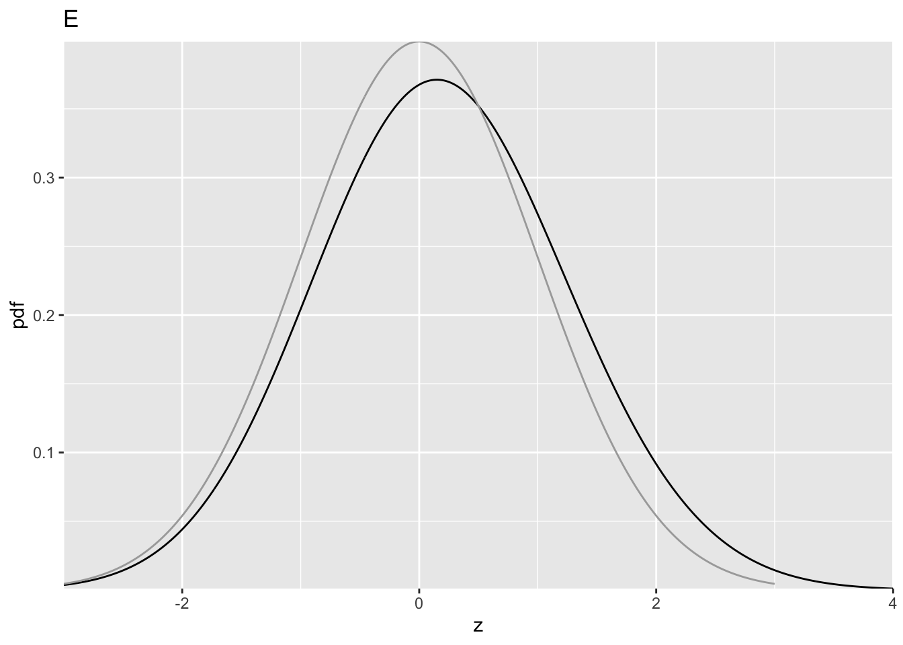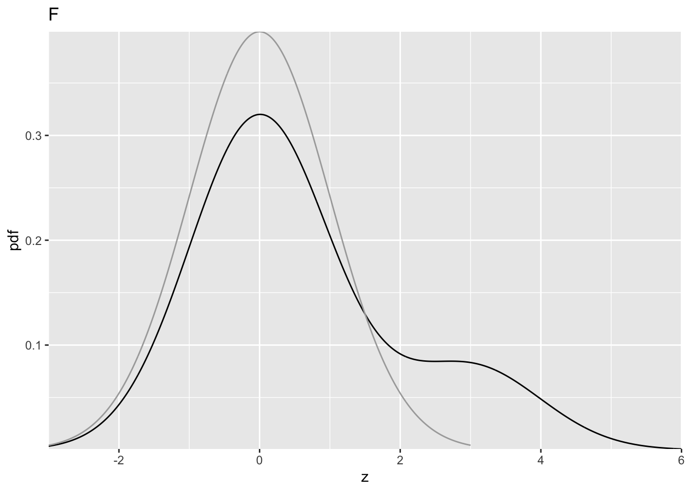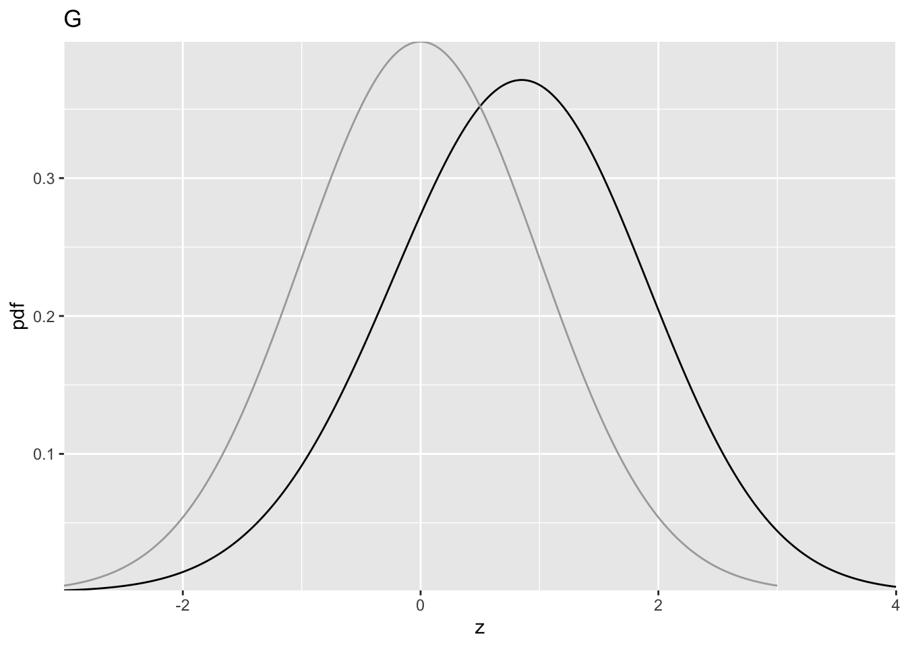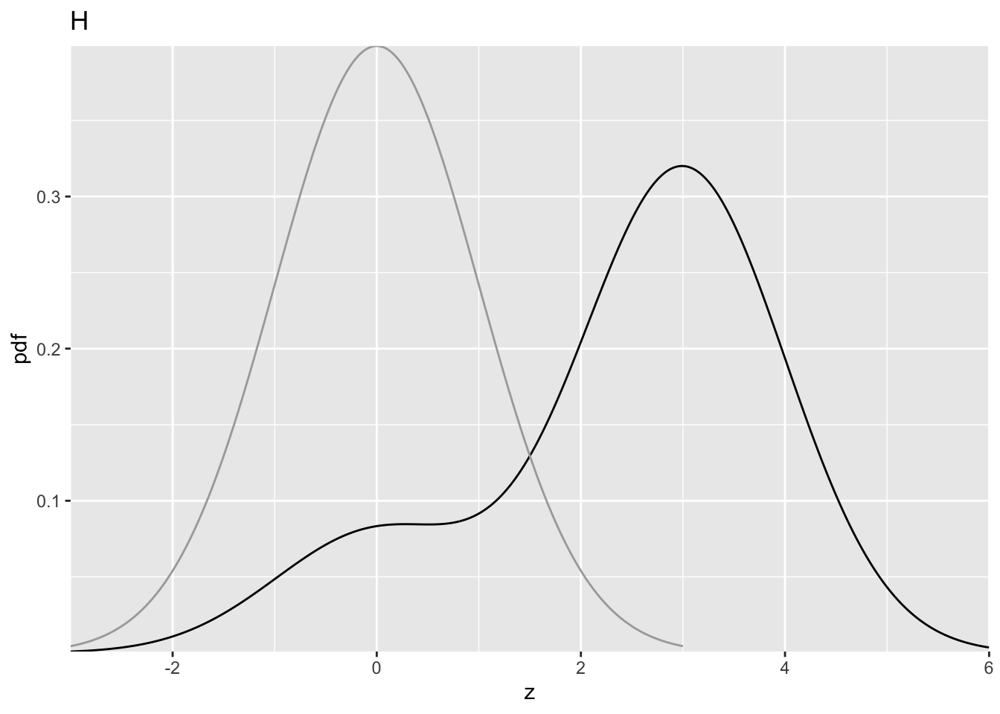

## Comments
The dark line is the diseased distribution. The grey line is the non-diseased distribution. The bimodal diseased distribution is clearly evident in plots F and H. 

## likelihood ratio plots

```
#> Fig. I : mu =  1 , alpha =  0.2
#> Fig. J : mu =  3 , alpha =  0.2
#> Fig. K : mu =  1 , alpha =  0.8
#> Fig. L : mu =  3 , alpha =  0.8
```

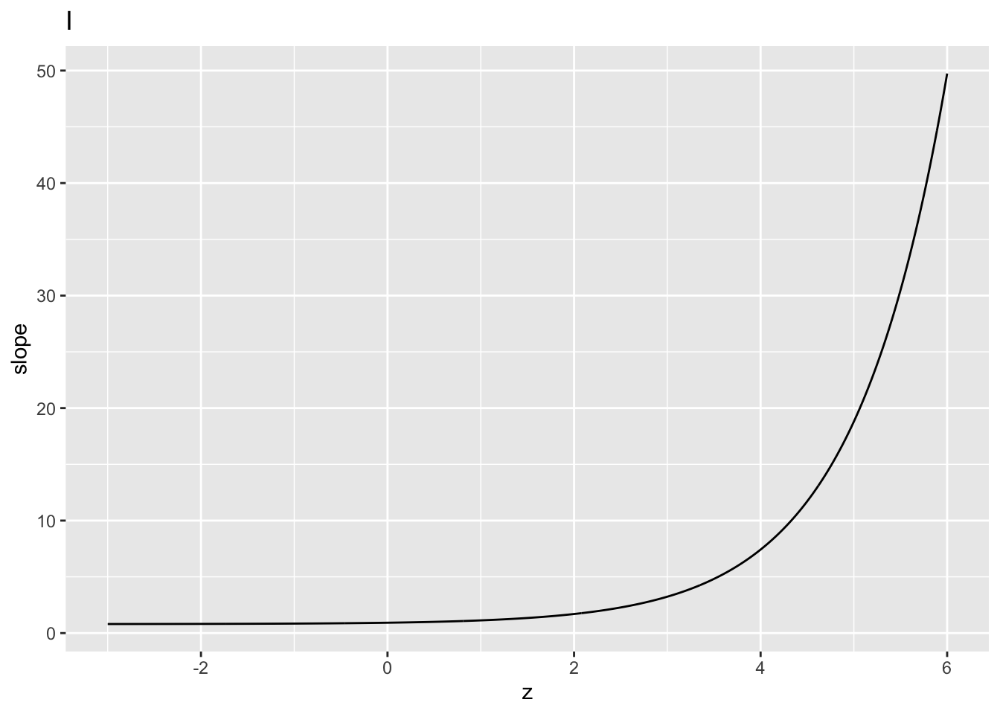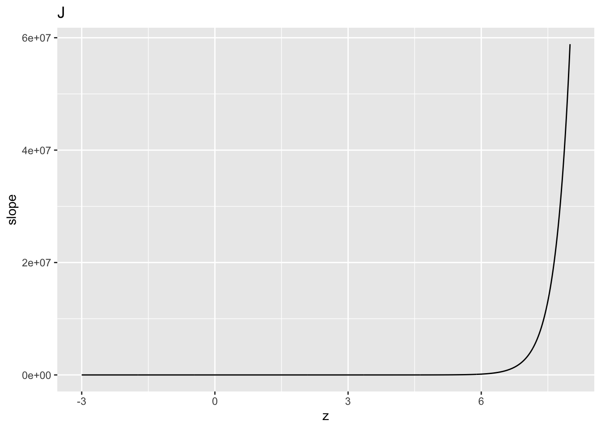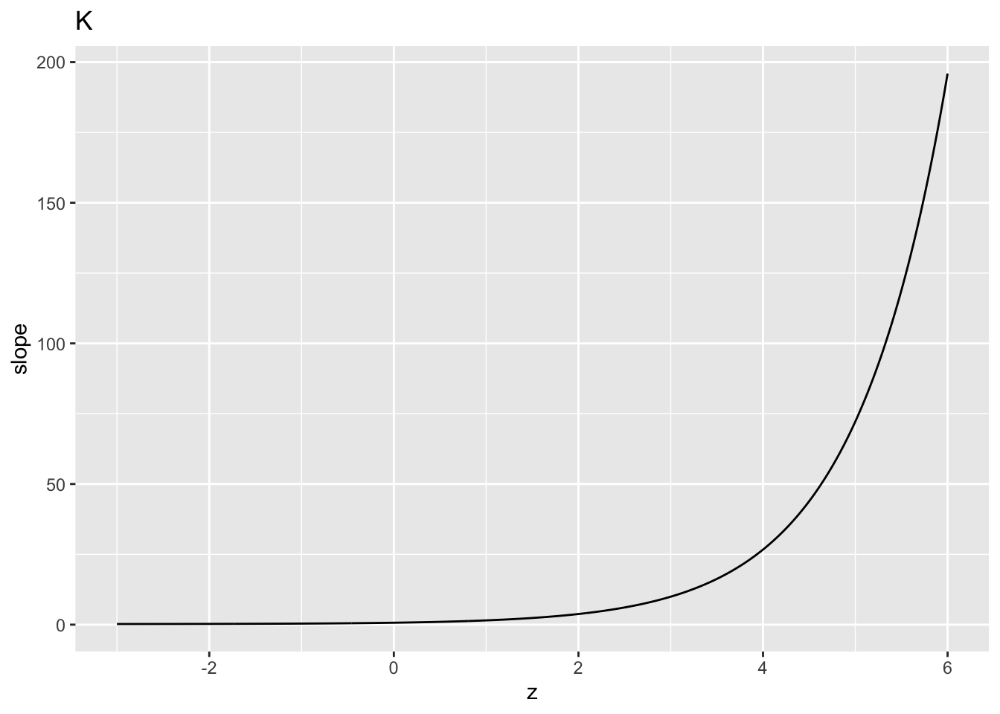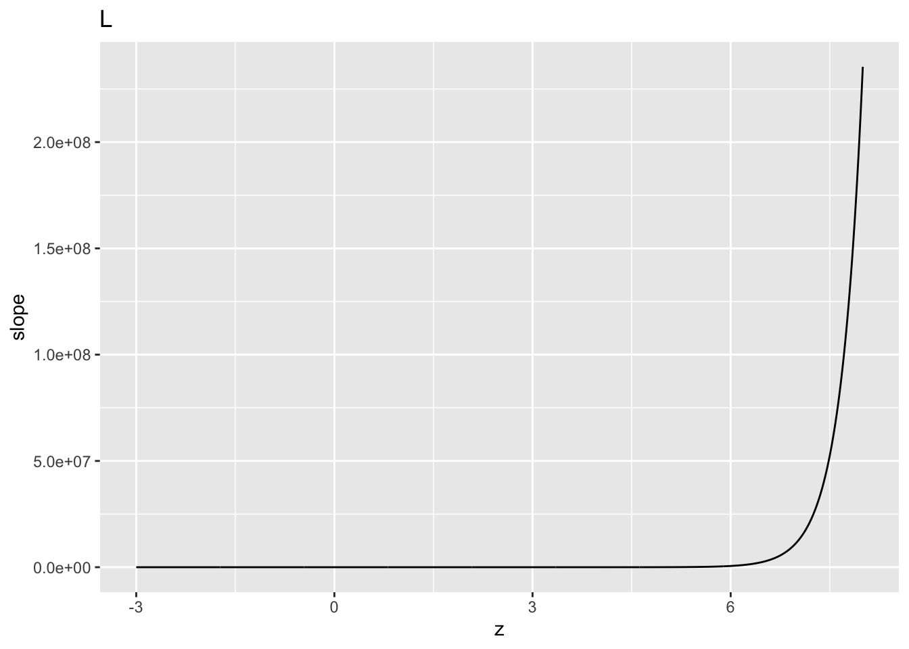

## Comments
Close examination of the region near the flat part shows it does not plateau at zero; rather the minimum is at 1 - $alpha$, explaining the non-zero limiting slope of the predicted curve near (1, 1).
